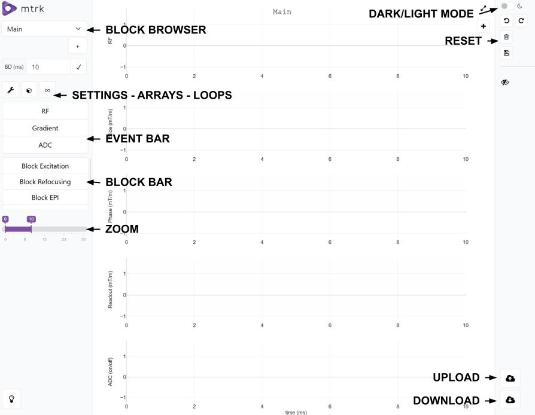

## What is mtrk?

mtrk is a novel concept for developing and working with pulse sequences in Magnetic Resonance Imaging (MRI). Traditionally, MRI pulse sequences are developed as dynamically loadable binary libraries, programmed using vendor-provided proprietary SDKs. These monolithic SDKs are complex, barely documented, and only in part accessible to external developers and members of the MRI research community. This makes MRI development very challenging - on the one hand because only few researchers manage to work with the SDKs, on the other hand because frequent invasive changes to the vendor SDKs create significant maintenance effort. Furthermore, strict license agreements make dissemination of research developments impossible and contend with the idea of reproducible research.

mtrk is an attempt to change the paradigm in MRI sequence development towards a modern Open-Source-driven model. While current open-source and vendor-agnostic initiatives like Pulseq (Layton et al., MRM, 2017) or SequenceTree (Magland et al., MRM, 2016) provide reliable solutions to design an share pulse sequences, mtrk comes with a complementary concise and user-friendly Sequence Description Language (SDL) file format. Its two-fold goal is to enable rapid exchange of SDL files for cloud computing and smooth sequence tuning by either manual modification of the SDL file, Python command line, or a web-based graphical interface.

mtrk takes the shape of an open-source framework for MRI pulse sequence development. It includes a Python api (mtrk_designer_api) to generate .mtrk sequence description files using the Json-based SDL. To ease the programming, mtrk also proposes a web-based drag-and-drop interface to design pulse sequences (mtrk_designer_api). .mtrk files can be visualized in the web-based mtrk_viewer and sent to the mtrk driver sequence (mtrk_seq) to play on a Siemens scanner. 

A conversion tool is also available in mtrk_designer_api to transform .mtrk files into Pulseq files, allowing for the use of any Pulseq-based external tool.  

<p align="center">
  
</p>

## Flexibility

mtrk uses a highly modular design in which sequences are formulated using a Sequence Description Language (SDL) based on the common JSON syntax. The SDL is un-opinionated, meaning that multiple ways for formulating one sequence exist. Moreover, the SDL makes no assumption on how the SDL files have to be generated, giving researchers the freedom of choice regarding which programming language they want to use for their sequence development projects. Moreover, because the SDL is a common text-based format, the sequence calculation can be done on any operating system and on any computer, ranging from the MRI scanner’s console computer over local research servers to cloud instances.

<p align="center">
  
</p>

## Accessibility

mtrk provides a graphical user interface (mtrk_designer_gui), which enables the development of pulse sequences in an intuitive way without programming. This web-based GUI is intended to be used both for education and training, as well as for research applications later on. It has for now been used to implement simple sequences, such as spin echo and gradient echo with single line readout, but will soon be able to handle more complex ones. 

To improve accessibility, the SDL format can be converted to Pulseq, which is already widely used in open-source pulse sequence programming. We are also working on a converter from Pulseq to SDL to make the connexion between the two formats smoother. 

## Reproducibility

When executing an mtrk sequence, the MRI scanner plays out the instructions and pulses contained in the mtrk file. This means that the pulse sequence is entirely defined by the mtrk file and not dependent on the specific MRI software version used during data acquisition. Hence, researchers can reproduce scientific results at a later time or at a different location because the mtrk file can be easily archived or distributed. Because the SDL format is decoupled from the vendor SDKs, the mtrk files can be shared in Git repositories attached to publications without violating license agreements, and they do not require refactoring for every software update installed on the MRI scanners.

## Transparency

With the traditional development model, sequence binaries are black-boxes in the sense that it is unclear how the sequence settings translate into DSP instructions. Moreover, because part of the functions are hard-coded into the MRI software platform and can change with every release, it is impossible to say which exact waveforms and timings were used to acquire the data. With mtrk on the other hand, all instructions can transparently be read form the mtrk file. This enables exact Bloch simulations of the sequence, so that automated testing and quality control of sequences is possible. Furthermore, part of the development work can be shifted from sitting in front of an MRI scanner towards simulation-driven development.

## Documentation

To learn more, please take a look at the mtrk [Documentation](https://mtrk-dev.github.io/doc/). Please note that mtrk is still under active development, so that the code and documentation may not be complete yet and evolve over time. Please also don’t hesitate to get in touch with us if you like to contribute to the development.

## Installation

### Test Installation (using Vagrant)

A quick test installation of the MTRK tools (prototype state) can be done using Vagrant, which will provision a VM and install the software automatically into the VM.

Install both [VirtualBox](https://www.virtualbox.org) and [Vagrant](https://www.vagrantup.com) on your host computer. This can be done using any computer with an Intel chipset (Windows, Linux, Intel-based Apple Mac).

Run a terminal with admin rights.

Clone the MTRK Designer GUI repository into a folder on your computer:

`git clone https://github.com/mtrk-dev/mtrk_designer_gui.git`

Change the directory and run the vagrant command:

```
cd mtrk_designer_gui
vagrant up
```

This will create in a few minutes a new VM and install all required dependencies. Once the installation has finished, the MTRK Designer GUI and MTRK Viewer Software can be accessed by opening the URLs `127.0.0.1:5010` and `127.0.0.1:6010` respectively in a modern browser (Firefox or Chrome).

If the page is not visible at the designated port. Run the `vagrant port` command to see if the port has been auto-forwarded due to a collision and access the tool on that port.

### Server Installation

Automatic installation on a production server can be done using a provided installation script. MTRK currently requires **Ubuntu 22.04 LTS** as the operating system, although the api can be operated on any machine running Python.

Check out the repositories on the server and start the installation:
```
cd /opt
git clone --depth 1 https://github.com/mtrk-dev/mtrk_viewer.git
git clone --depth 1 https://github.com/mtrk-dev/mtrk_designer_gui.git
cd mtrk_designer_gui/app
git clone --depth 1 https://github.com/mtrk-dev/mtrk_designer_api.git
sudo bash /opt/mtrk_designer_gui/install.sh
```

## Getting started

This is a quick tutorial to getting started with mtrk. It covers how to use the GUI to import and modify a sequence described in an SDL file, how to use the viewer to visualize it, and how to run the converter to generate the corresponding Pulseq file. 

### mtrk designer

<p align="center">
  
</p>

- After turning the vagrant VM on, load the mtrk designer in a web browser at the URL `127.0.0.1:5010` (please check your port with `vagrant port` if this is not working).
- Choose between dark and light mode for your comfort.
- Drag and drop a gradient event from the event bar to any gradient line (Readout/Phase/Slice).
- Click on it to access its parameters.
- Close the parameters window.
- You can do the same for RF pulses and ADC events. 
- Click on the "reset" button and confirm you want to reset the page.

<p align="center">
  
</p>

- Download and import the [gre2d.mtrk](https://github.com/mtrk-dev/mtrk_designer_api/blob/main/testData/gre2d.mtrk) file provided in the "mtrk_designer_api/testData" folder using the upload button.
- Check the structure of the sequence with the "loops" button.
- Check the header of the sequence with the "settings" button.
- Select "block_TR" in the block browser.
- Add an RF event starting at 5.1ms on the RF axis, name it "refocusing_pulse", slect its type as "Refocusing", give it a flip angle of 180 degrees, and select "rf_pulse" and "rf_phase" for its amplitude and phase arrays. Save the changes. 
- Add a gradient just under this RF pulse on the Slice axis, name it "slice_sel_refocusing", put its start time at 5ms, its amplitude at 4.95mT/m, and select the "grad_100_2650_100" array. Save the changes.
- Click on the "Download" button to download an updated SDL file "output_sdl_file.mtrk".
- (Optional) Open both SDL files (gre2d.mtrk and output_sdl_file.mtrk) and compare them.

### mtrk viewer

<p align="center">
  
</p>

- Load the mtrk viewer in a web browser at the URL `127.0.0.1:6010` (please check your port with `vagrant port` if this is not working).
- Upload the "gre2d.mtrk" file.
- Use the zoom options to zoom on an elementary pattern of the sequence.
- Hover over RF pulses, gradients, and ADC events to check their names and amplitudes.
- Do the same with the "output_sdl_file.mtrk" and verify that the changes are properly reflected.

### Conversion to pulseq

<p align="center">
  
</p>

- Clone the mtrk_designer_api repo (you can create a virtual environment to contain the python libraries installation) and go to the "mtrk_designer_api" folder.
```
git clone --depth 1 https://github.com/mtrk-dev/mtrk_designer_api.git
cd mtrk_designer_api
```
- Run `pip install -r requirements.txt` to install the required dependencies.
- Convert both "testData/gre2d.mtrk" and "testData/output_sdl_file.mtrk" into "testData/gre2d.seq" and "testData/output_sdl_file.seq" by running `python mtrkToPulseqConverter.py` (it will prompt for file names in the console) and compare the output diagram to the one observed in the mtrk viewer. 


## Related publications

### Journal papers
- Artiges A, Singh Saimbhi A, Castillo-Passi C, Lattanzi R, and Block KT, mtrk - A flexible environment for developing open-source MRI pulse sequences, submitted to MRM in March 2025.

### Conferences
- Artiges A., Singh Saimbhi A., Wiggins R., Lattanzi R., and Block KT., mtrk – A flexible open-source framework for developing MRI pulse sequences based on common web standards. International Society for Magnetic Resonance in Medicine (ISMRM, 2024) - Poster presentation.(https://submissions.mirasmart.com/ISMRM2024/Itinerary/PresentationDetail.aspx?evdid=5911). Includes a video demo of the software.
- Artiges A, Singh Saimbhi A, Wiggins R, Castillo-Passi C, Montin E, Giannakopoulos I, Lattanzi R, and Block KT, mtrk – An intuitive and open-source development kit for MRI pulse sequences. MRI Together workshop 2025 - Oral presentation. (Best abstract award - 2nd place, recording on YouTube: https://www.youtube.com/watch?v=KraT1FKSTcc)
- Artiges A, Singh Saimbhi A, Wiggins R, Castillo-Passi C, Montin E, Giannakopoulos I, Lattanzi R, and Block KT, mtrk - Un environnement intuitif pour le développement de séquences IRM libres de droits. Bi-annual meeting of the SFRMBM (France) 2025 - Poster presentation.
- Artiges A, Singh Saimbhi A, Castillo-Passi C, Montin E, Giannakopoulos I, Lattanzi R, and Block KT, Comparison of mtrk, Pulseq, and vendor sequences using simulated, phantom, and in-vivo acquisitions.  International Society for Magnetic Resonance in Medicine (ISMRM, 2025) - Oral presentation.


Contact: anais.artiges@nyulangone.org

### Acknowledgements

<p align="center">
  
</p>

mtrk is part of Cloud MR, a multi-year project aimed at developing a comprehensive software platform to simulate all aspects of the MRI experiment. This research project is supported by the National Institute of Biomedical Imaging and Bioengineering (NIBIB) of the National Institutes of Health (NIH) under the Awards R01 EB024536 (PI: Riccardo Lattanzi).


